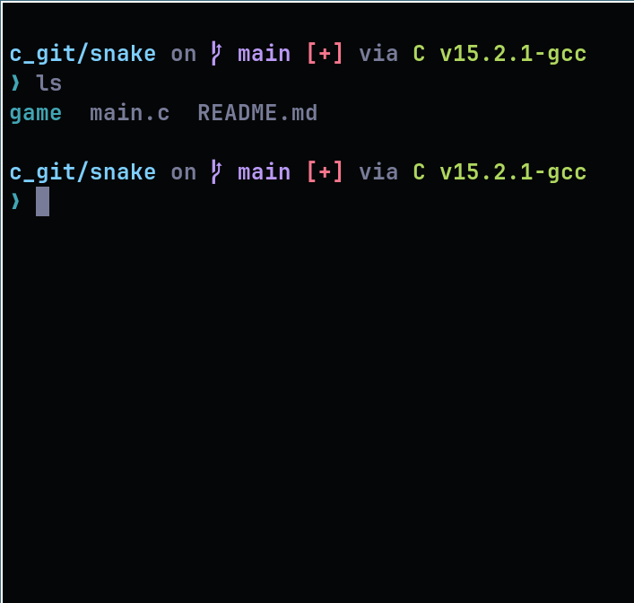

# Snake em C

Este é um projeto de estudos onde desenvolvi o Jogo da Cobrinha utilizando a linguagem C. O objetivo foi explorar a manipulação de terminal, lógica de jogos e gerenciamento de entrada de teclado em baixo nível.

## Sobre o Projeto

O foco principal foi criar um jogo funcional que rodasse diretamente no terminal, sem o uso de engines gráficas. Tive o `auxílio` do ChatGPT para entender melhor as configurações específicas de terminal e a captura de eventos do teclado (input não bloqueante).

## Tecnologias e Aprendizados

- **Linguagem:** C
- **Conceitos aplicados:** Estruturas de dados (structs), loops do jogo (game loops) e manipulação de cordenadas no console.

## Como Rodar

Para compilar e rodar o projeto, você precisará de um compilador C

1. Clone o repositório:
   `git clone https://github.com/seu-usuario/snake-c.git`
2. Compile o código:
   `gcc main.c -o snake`
3. Execute o jogo:
   `./snake`

---
*Ainda sou iniciante no mundo do baixo nível, mas meu interesse pela área aumenta a cada linha de código!*

